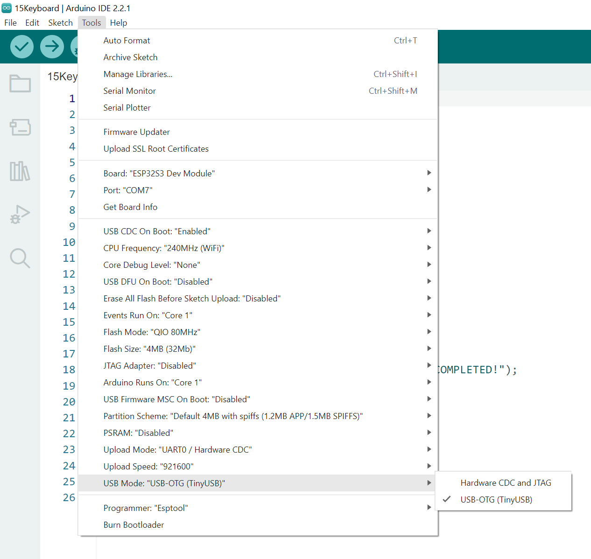

# Day fifteen:

Transform your Barduino in a Keyboard! The ESP32S3 has a USB-OTG mode, making it possible to be recognised as a keyboard by the computer. Use it to create your own keyboard. 

!!! danger "Arduino Tips"
    If you use the same method we used to create a HID (Human Interface Device) keyboard you have to change the *USB Mode: USB-OTG (Tiny USB)* setting under *Tools* in Arduino. 
    
    Using this mode, you have to use *Boot Mode* to program the board (Press *Boot 00* button while reseting). When programming the board may change the *Port* number, so to programmed back you may need to change the port. 

## Possible solution!

### Arduino code

```c++
#include "USB.h"
#include "USBHIDKeyboard.h"
USBHIDKeyboard Keyboard;

const int but = 0;
int previousButtonState = HIGH; 
bool pressed = false;

void setup() {
  pinMode(but, INPUT);
  Keyboard.begin();
  USB.begin();
}

void loop() {
  if (!digitalRead(but) && !pressed) {
    pressed = true;
    Keyboard.println("Adventronics day 15 challenge COMPLETED!");
  }
  else if (digitalRead(but)){
    pressed = false;
  }
}

```

## Hero shot

Adventronics day 15 challenge COMPLETED!

<video controls autoplay loop style="display: block; margin: auto;">
    <source src="../../../video/day15.mp4" type="video/mp4">
</video>